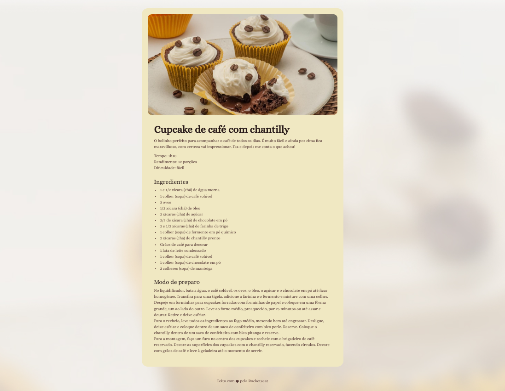

# Página de Receita - HTML & CSS

## Descrição

Este projeto é uma página de receita simples criada usando HTML e CSS. A página exibe uma receita específica com imagens e texto fixos.

## Pré-requisitos

Para visualizar este projeto, você precisará de um navegador da web moderno, como Google Chrome, Mozilla Firefox, Safari ou Microsoft Edge.

### Captura de Tela

